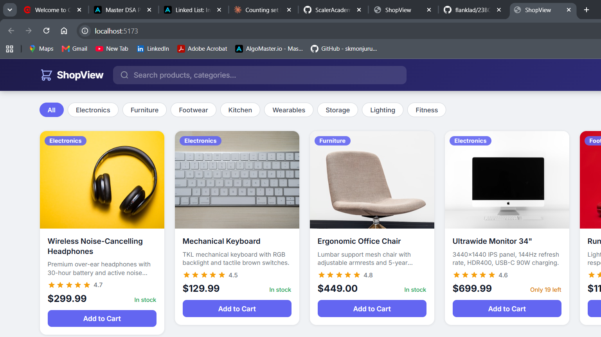

# ShopView — React Data-Fetching UI

A fullstack product listing dashboard built with **React + Vite** (frontend) and **Spring Boot** (backend REST API).

Demonstrates the core data-fetching lifecycle: loading skeletons → live product grid → error state with retry.

## Screenshot



## Features

- Fetch from Spring Boot REST API on component mount (`useEffect`)
- Animated shimmer skeleton cards while loading
- Responsive product grid (auto-fill, min 240 px columns)
- Category filter pills + live search
- Error state with descriptive message and "Try again" button
- Per-card: image with lazy loading, star rating, stock status badge, Add to Cart button

## Stack

| Layer | Technology |
|---|---|
| Frontend | React 18, Vite 5, plain CSS |
| Backend | Spring Boot 4, Java 21, Tomcat |
| API | `GET /api/products` — returns 12 seeded products |

## Project Structure

```
SHOPVIEW-REACT/
├── frontend/                  # Vite + React app
│   ├── src/
│   │   ├── App.jsx            # State machine: idle | loading | success | error
│   │   └── components/
│   │       ├── Header.jsx     # Sticky header with search
│   │       ├── ProductGrid.jsx
│   │       ├── ProductCard.jsx
│   │       ├── SkeletonGrid.jsx   # Shimmer loading placeholders
│   │       └── ErrorState.jsx     # Error + retry UI
│   ├── vite.config.js         # Proxies /api → localhost:8080
│   └── package.json
└── src/main/java/             # Spring Boot REST API
    └── swc/assignment1fsswc/
        ├── ProductController.java   # GET /api/products
        └── Product.java
```

## How to Run

**Terminal 1 — backend:**
```bash
./mvnw spring-boot:run
# Starts on http://localhost:8080
```

**Terminal 2 — frontend:**
```bash
cd frontend
npm install
npm run dev
# Opens on http://localhost:5173
```

Vite proxies all `/api/*` requests to the Spring Boot server, so no CORS issues in development.
